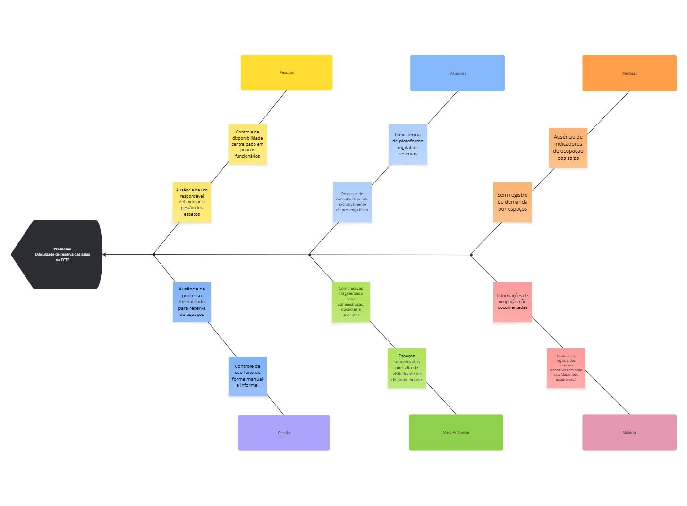

# 1. Visão geral do produto

# 1.1 Problema
- Em razão da comunidade acadêmica utilizar espaços acadêmicos para atividades de ensino, pesquisa e estensão distribuídas por salas de aula, laboratórios e auditórios, a verificação da disponibilidade dos espaços da FCTE é realizada por meio de processos ultrapassados, sem qualquer mecanismo digital de consulta ou agendamento. Essa ausência dos processos digitais inviabiliza o planejamento remoto e a reserva antecipada online dos espaços da FCTE, prejudicando toda a comunidade.

- Em decorrência disso, para uma melhor  análise e detecção do problema elaborou-se o Diagrama de Ishikawa, como observado na figura 1,  no qual identificaram-se fatores geradores e intensificadores na dificuldade de reservas de salas, laboratórios e auditórios. Observou-se, por exemplo, a informalidade no controle de acesso às salas, bem como a ausência de um responsável previamente definido. Neste contexto, pode ocasionar possíveis conflitos de agenda, perda de produtividade e por muitas vezes desistências, o que reitera a urgência de uma solução que corrobora para um espaço acadêmico mais organizado, acessível e funcional.

-                                       Figura 1 - Diagrama de Ishikawa

-   
Fonte: Elaborado pelos autores, 2026

- Diante do exposto, para resolver esse problema, a solução proposta é o Seu espaço UnB. O SeU (Seu espaço UnB) é uma aplicação web que integra a administração da FCTE e a comunidade acadêmica, com o objetivo de digitalizar a consulta e a reserva de espaços físicos dentro da faculdade. O sistema contará com algumas funcionalidades como permitir que os usuários consultem em tempo real a disponibilidade dos espaços, visualizem as características e recursos disponíveis e realizem solicitações de forma remota. Para a administração e os funcionários técnicos, será possível aprovar ou rejeitar solicitações, gerenciar a ocupação dos espaços e manter suas informações atualizadas. Espera-se, dessa forma, eliminar deslocamentos desnecessários, reduzir os conflitos de horários e aumentar a eficiência no uso da infraestrutura da FCTE.

# 1.2 Declaração de Posição do Produto
- Um sistema web que permite a consulta da disponibilidade e a reserva de espaços físicos da FCTE, promovendo maior integração entre a administração e a comunidade acadêmica. Iniciativas semelhantes já foram desenvolvidas em outras instituições, como o UniEspaços, aplicativo criado na Universidade Estadual do Sudoeste da Bahia (UESB), que centraliza o processo de solicitação e aprovação de reservas de espaços acadêmicos (PINHEIRO, 2026). O sistema se diferencia por oferecer uma busca mais precisa por critérios pré-definidos, notificações sobre os status das solicitações e integração com o Google Agenda, com uma interface moderna e atualizada. 
Os usuários do sistema são a comunidade acadêmica da FCTE, composta por solicitantes - alunos, professores, monitores, equipes de competição e empresas juniores - que consultam a disponibilidade e realizam reservas de espaços; e por gestores - secretaria, técnicos, porteiros e equipes de segurança - responsáveis por aprovar solicitações e gerenciar a ocupação dos espaços. O cliente do produto é a própria instituição, representada pela FCTE, interessada em otimizar o uso da infraestrutura e reduzir conflitos de ocupação.
A adoção do sistema permitiria à FCTE centralizar a gestão de seus espaços físicos em uma única plataforma digital, reduzindo conflitos de ocupação, eliminando processos manuais de verificação e tornando o acesso aos espaços mais ágil e organizado para toda a comunidade acadêmica.
A escolha do nome “Seu espaço UnB” foi pautada na intenção de traduzir a complexidade da gestão de espaços físicos em uma experiência intuitiva e integrada ao cotidiano acadêmico. Além de transmitir a ideia de pertencimento, autonomia e acessibilidade, esse nome coloca a comunidade no centro da experiência e rompe a percepção de que a busca por um espaço na faculdade é algo complexo e burocrático.

